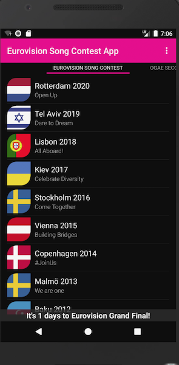

# ESC APP

ESC App is an Android application for previewing Eurovision Song Contest entries. Read the app history [here](./docs/story.md).



## Setup environment

1. Install [Android Studio](https://developer.android.com/studio) and open the project.

1. [Acquire key](https://developers.google.com/youtube/android/player/register) for YouTube API.

1. Create file `local.properties` to project root. Add your API key there as following:

    ```
    youtube.developer.key="XXX"
    ```

1. Launch project in emulator.