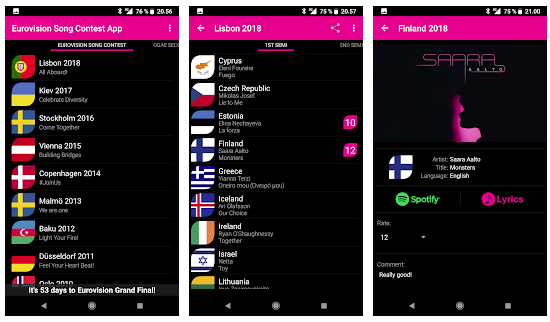
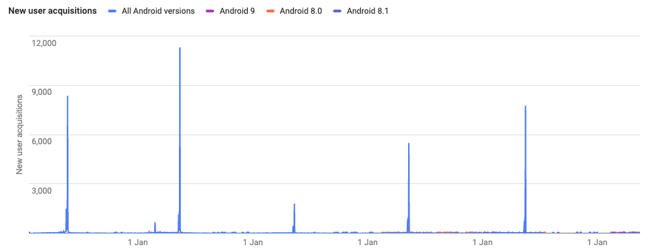

# Herstory of ESC App

It is the eve of Eurovision Song Contest (ESC) 2020 final. I should be in Rotterdam sipping nice dutch beer and listening to the Eurovision 2020 entries for the nth time. Instead, I am housebound for how many weeks due to Covid-19. Nevertheless, for a Eurovision fan, it is Eurovision week. To celebrate it I decided to share Eurovision joy to the world in the form of [source code](https://github.com/lauravuo/escapp-android).

For several years now I have been coding small projects in my free time. The purpose has been both to increase my knowledge about various technologies and also to create useful utilities missing from my everyday life.

It was already 2012 when I realized for the first time that one essential app is missing from my mobile device. An app that would record my ESC ratings. I also needed a guide in the ESC arena. A timetable to tell me when it was time to pop to the loo or get more drinks: it is always a disaster if you miss your favorite performance. Besides, at that time there was no such thing (or money) as roaming-all-the-time, so the information had to be available offline.

My first try was for the Symbian platform, a simple app that displayed the 2012 contestants and some information about them. I even released the app in [Nokia Ovi Store](<https://en.wikipedia.org/wiki/Ovi_(Nokia)>), but "unfortunately" the future of that platform (and app with it) was cut short. Then in 2014 I had some spare time in between jobs and started a new project targeting Android.

I didn't have much experience from Android application development. Anyhow the dive into Android wasn't too deep because of my strong mobile development background from work and Java studies in the university. And hey - compared to development on top of Symbian - anything seems easy.

The app UI is quite simple, the list of the contestants is displayed in tabs grouped by contest semifinals. Tapping the list item opens a detailed view that provides an embedded player with the song YouTube video and rating controls. The ratings can be shared either as text or image to friends. Data is stored in a local database, so there is no backend server.

From the start, it was obvious that displaying the contestants for a single year at the time was not enough. Instead, the app needed a simple way to add new contest years so that old data would still remain. Therefore the static contest data is stored to the project as XML data files that are dynamically parsed when the app launches.

Designing the functionalities and coding itself was quite fun. I even got some help from my friend to create the application graphics. The only tricky part has been the app publishing process to Google Play Store.

[The app](https://play.google.com/store/apps/details?id=com.escapp) has gained popularity yearly mainly in May during the contest. Overall downloads through the years are nearly 60k, a great result for a fun free time project!

What has become clear is that it seems the Play Store is not too keen on seeing free applications without advertisements getting thousands of downloads. Over and over again the app has been removed from the store for "breaking of intellectual property rights". For example, renaming of the app has become a yearly habit of mine because of the so-called violations.

If starting over, next time I would definitely skip the app store publication. For this kind of simple app that does not require the native capabilities of the mobile device, a web service or [PWA](https://en.wikipedia.org/wiki/Progressive_web_application) would do perfectly. Today I would also implement a backend server to store (_and analyze_) the user data. And god no - would I ever use XML in any scenario to store data again.

Anyway, for those who are interested to take a peek (_or even contribute_), the codes are available in [GitHub](https://github.com/lauravuo/escapp-android). Happy Eurovision 2020!
